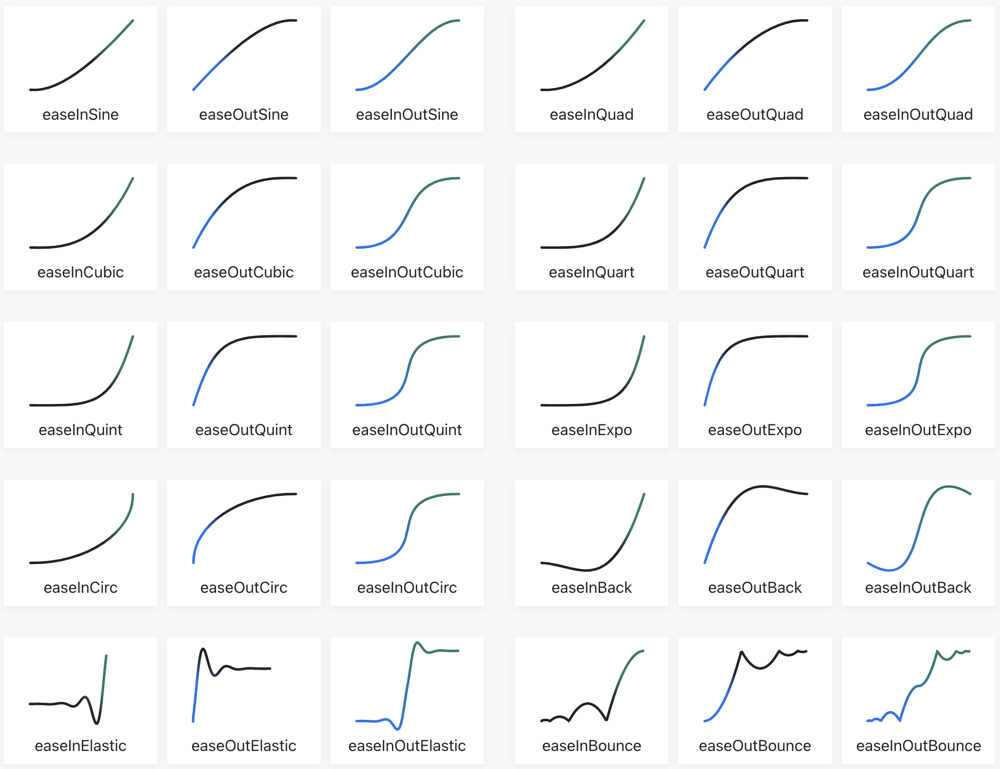

# Easing

Easing function calculations



## Credits

This library implements all of the easing functions as provided on https://easings.net written by [Andrey Sitnik](https://sitnik.ru/) and [Ivan Solovev](https://solovev.one/) with slight modifications to the mathematical implementations to account for Elixir's immutability.

## Description

Calculates the easing value of a given function and progress of an animation represented by a range between `0..1`. The following easings are availalbe with _in_, _out_, and _in\_out_ varients:

Note: If you'd like to see visualizations of the easing calculations visit https://easings.net

* [Linear](https://en.wikipedia.org/wiki/Linear_function)
* [Sine](https://en.wikipedia.org/wiki/Sine_and_cosine)
* [Quadratic](https://en.wikipedia.org/wiki/Quadratic_function)
* [Cubic](https://en.wikipedia.org/wiki/Cubic_function)
* [Quartic](https://en.wikipedia.org/wiki/Quartic_function)
* [Quintic](https://en.wikipedia.org/wiki/Quintic_function)
* [Exponential](https://en.wikipedia.org/wiki/Exponential_function)
* [Circular](https://en.wikipedia.org/wiki/Trigonometric_functions)
* [Back](https://easings.net/#easeInOutBack)
* [Elastic](https://easings.net/#easeInOutElastic)
* [Bounce](https://easings.net/#easeInOutBounce)

## Installation

If [available in Hex](https://hex.pm/docs/publish), the package can be installed
by adding `ease` to your list of dependencies in `mix.exs`:

```elixir
def deps do
  [
    {:easing, "~> 0.3.0"}
  ]
end
```

## Usage

### Calculating a single point

You can calculate a single point for a function along the progress of an animation:

```elixir
iex> Easing.sine_in(0.4)
0.19098300562505255
```

### Calculating a list of animation frame values

However you likely want to calculate the list of values for a given animation. `Easing.to_list/2` will take a `Easing.Range` struct and the easing as either a function reference or a tuple.

```elixir
iex> Easing.to_list(%Easing.Range{first: 0, last: 0.5, step: 0.1}, &Easing.bounce_in_out(&1))
[0.0, 0.030000000000000027, 0.11375000000000002, 0.04499999999999993, 0.3487500000000001, 0.5]
iex> Easing.to_list(%Easing.Range{first: 0, last: 0.5, step: 0.1}, {:bounce, :in_out})
[0.0, 0.030000000000000027, 0.11375000000000002, 0.04499999999999993, 0.3487500000000001, 0.5]
```

### Calculating animation frames from a Stream

In many cases you will generate many animation frame values and it may be most performant to calculate those values lazily. We can easily do this with [Elixir Streams](https://elixir-lang.org/getting-started/enumerables-and-streams.html#streams)

```elixir
iex> Easing.stream(%Easing.Range{first: 0, last: 1, step: 0.0001}, &Easing.sine_in/1) |> Enum.take(3)
[0.0, 1.2337005528273437e-8, 4.9348021557982236e-8]
```

`Easing.stream/2` also take a `tuple` similar to `Easing.to_list/2`

### Custom easing functions

There is no need for you to limit to the included easing functions. A custom easing function takes a single value and returns the approximation.

```elixir
iex> custom_easing = fn(progress) ->
  if progress < 0.5 do
    Easing.sine_in(progress) / 2
  else
    1 - Easing.sine_in(progress) / 2
  end
end

iex> Easing.to_list(Easing.Range.new(0, 1, 0.1), custom_easing)
[0.0, 0.006155829702431115, 0.024471741852423234, 0.054496737905816106,
 0.09549150281252627, 0.8535533905932737, 0.7938926261462367,
 0.7269952498697734, 0.6545084971874737, 0.5782172325201156, 0.5]
```

### `Easing.Range`

`Easing.Range` is a reimplementation of Elixir's `Range` struct but will allow for ranges to be built across and between fractional values
rather than limited to `Integer` values. You can create a new `Easing.Range` struct with either form:

```elixir
# struct form
iex> %Easing.Range{first: 0.5, last: 1, step: 0.1}
%Easing.Range{first: 0.5, last: 1, step: 0.1}

# function form
iex> Easing.Range(0, 0.5, 0.1)
%Easing.Range{first: 0, last: 0.5, step: 0.1}
```

There is also a convenience function:

```elixir
iex> Easing.Range.new(0, 1, 0.1)
%Easing.Range{first: 0, last: 1, step: 0.1}
```

You can also calculate the steps from a target frame rate

```elixir
iex> duration_in_ms = 1000
iex> fps = 60
iex> Easing.Range.calculate(duaration_in_ms, fps)
%Easing.Range{first: 0, last: 1, step: 1.6666666666666667e-5}
```

## Authors ##

* [Brian Cardarella](https://twitter.com/bcardarella)

[We are very thankful for the many contributors](https://github.com/dockyard/easing/graphs/contributors)

## Versioning ##

This library follows [Semantic Versioning](https://semver.org)

## Looking for help with your Elixir project? ##

[At DockYard we are ready to help you build your next Elixir project](https://dockyard.com/phoenix-consulting). We have a unique expertise
in Elixir and Phoenix development that is unmatched. [Get in touch!](https://dockyard.com/contact/hire-us)

At DockYard we love Elixir! You can [read our Elixir blog posts](https://dockyard.com/blog/categories/elixir)

## Legal ##

[DockYard](https://dockyard.com/), Inc. © 2022

[@DockYard](https://twitter.com/DockYard)

[Licensed under the MIT license](https://www.opensource.org/licenses/mit-license.php)